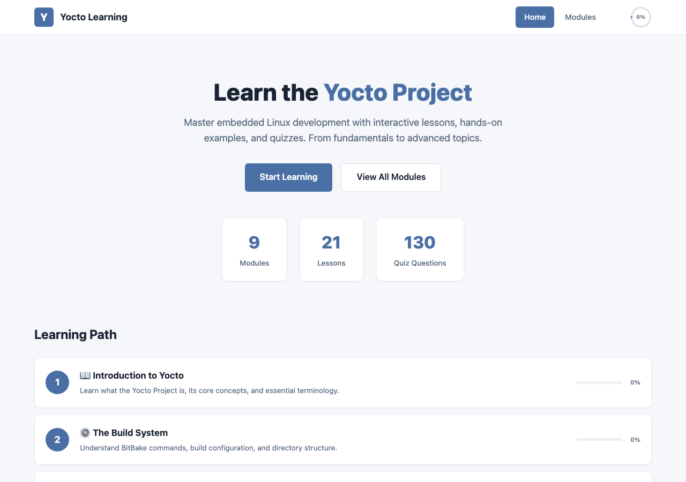
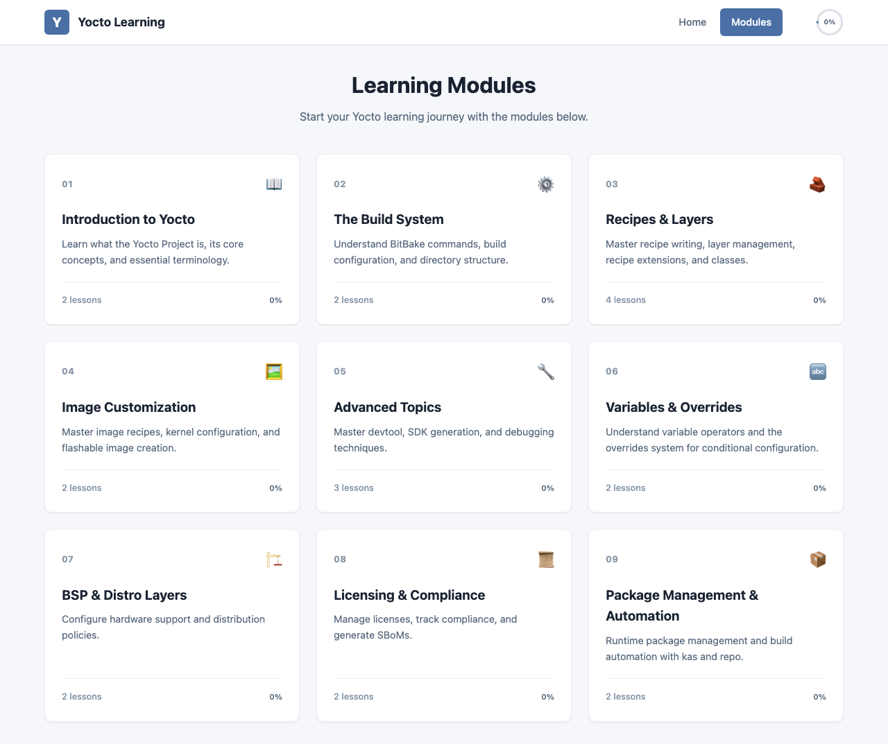
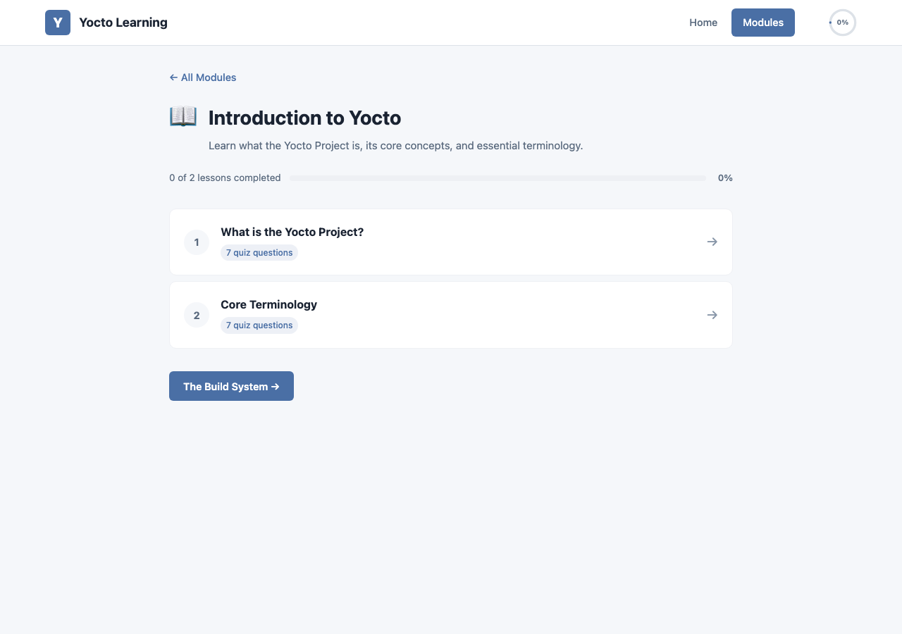
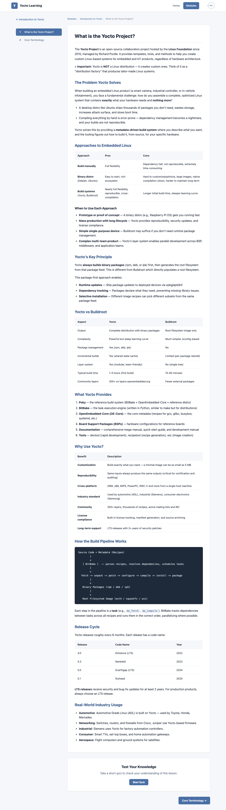

# Yocto Learning App

An interactive learning platform for the Yocto Project, featuring structured lessons, quizzes, and progress tracking. Built with React + Vite and deployed via Docker Compose.

## Features

- 9 learning modules, 21 lessons, 130 quiz questions
- Markdown-based lesson content with code highlighting and tables
- Real-time progress tracking (persisted in localStorage)
- Responsive design for desktop and mobile

## Screenshots

### Home Page


### Module Overview


### Module Detail


### Lesson Page


## Getting Started with Docker Compose

### Prerequisites

- [Docker](https://docs.docker.com/get-docker/) and [Docker Compose](https://docs.docker.com/compose/install/)

### Start the App

1. Clone the repository:

```bash
git clone <repo-url>
cd yocto-learning-app
```

2. Build and start the container:

```bash
docker compose up -d --build
```

3. Open your browser at [http://localhost:3000](http://localhost:3000)

### Stop the App

```bash
docker compose down
```

### Rebuild (after code changes)

```bash
docker compose up -d --build
```

## Local Development

```bash
npm install
npm run dev
```

The dev server starts at `http://localhost:5173` by default.

## Tech Stack

- **Frontend:** React 19 + Vite 7
- **Routing:** React Router (HashRouter)
- **Deployment:** Docker (multi-stage build) + Nginx
- **Styling:** Plain CSS (no UI framework)
